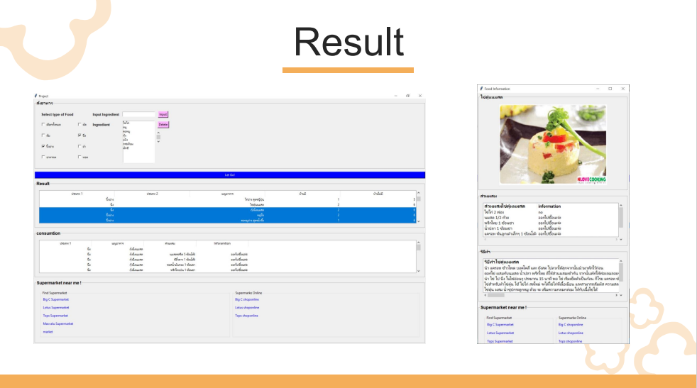

# Project Subject BADS6001 : IntroBads

Project “ What ingredient do you have?"
  
**Project organizers**  
  
Kodchakorn Lernsuksarn  
Supattra tangsakunrahong  
Salinwasu thiangtham  
  

## Introduction  
**Goal**  
1.Develop a program to suggest dishes that can be made from ingredients that are available at home.  
2.The program can suggest ingredients that need to be purchased in addition to making the desired menu.  
3.The program can also suggest stores near you that have ingredients that are still lacking.  
  
**Where we get the data?**  
  1. www.Kapook.com
  2. www.FIT KAB DAO.com
  3. www.HEALTHPLATZ.com
  4. www.nlovecooking.com

**DATA PREPARATION**  

- Using Excel for cleaning outlier

**Data analytic**

- Using Cosine Similarity : to create Association making recommendations based on the rules

**Result Program**  
 
